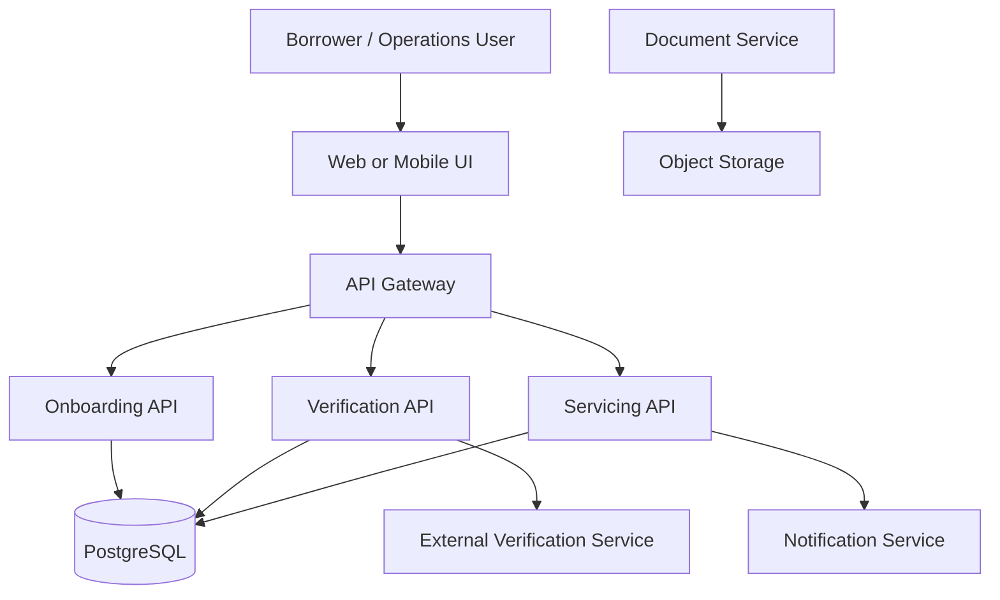
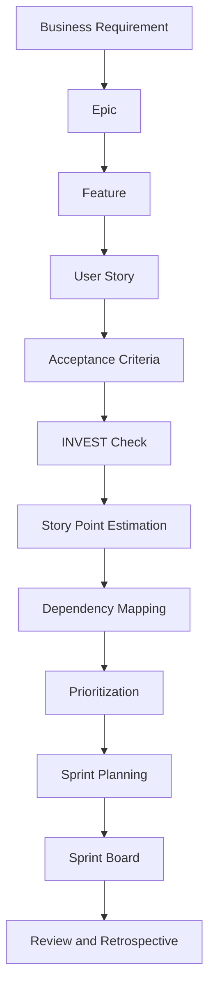
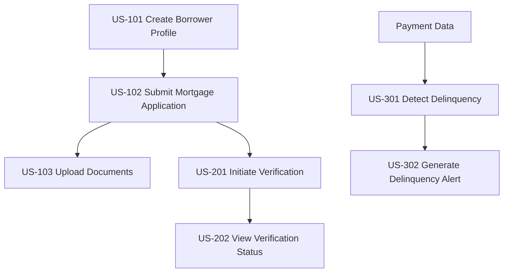
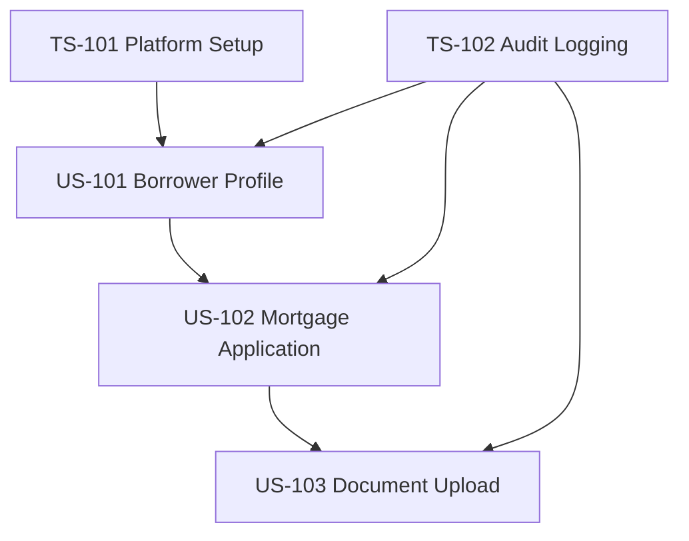
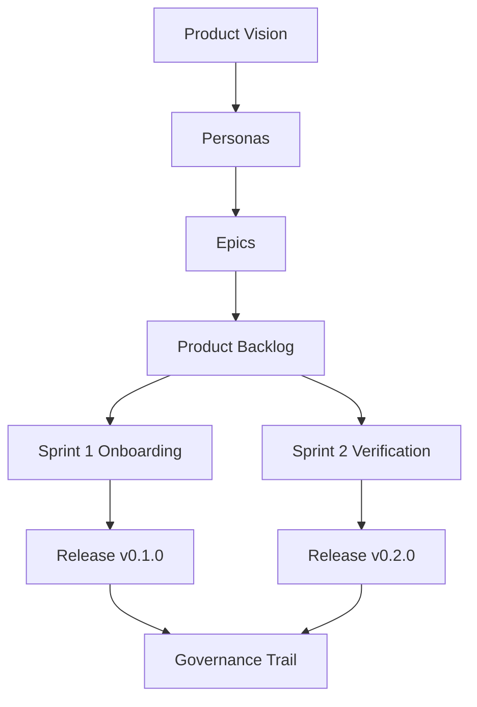

# Lab 03: Agile, Scrum, Story Writing, Sprint Planning, and Mortgage Capstone

**Audience:** Developers and delivery teams in the mortgage-platform training  
**Platform:** Jira preferred; Jira Free, Azure Boards, GitHub Projects, Trello, or spreadsheet-based boards are acceptable  
**Focus:** Agile delivery workflow from business requirement to sprint execution  
**Estimated time:** 3 hours  
**Last reviewed:** 2 September 2026

## Purpose

In this lab, you will convert mortgage-domain business needs into delivery-ready Agile work. You will:

- create a backlog hierarchy from Epic to Story;
- write high-quality user stories using the standard story format;
- define measurable acceptance criteria using Given/When/Then;
- apply INVEST and improve weak story statements;
- estimate stories using planning poker and story points;
- identify technical, enterprise, and compliance dependencies;
- create Sprint 1 and Sprint 2 plans for the capstone platform; and
- produce delivery artifacts expected in regulated enterprise teams.

This lab is planning and delivery design only. You are not required to build the application code.

## Completion criteria

The lab is complete when your team can show:

- one Epic and three Features for the core mortgage scope;
- user stories for onboarding, verification, and delinquency monitoring;
- acceptance criteria for each key story using Given/When/Then;
- at least one INVEST refactoring from vague request to compliant stories;
- story-point estimates with planning rationale;
- a dependency map that includes technical and external dependencies;
- Definition of Ready and Definition of Done checklists;
- Sprint 1 and Sprint 2 goals with story selections and capacity fit;
- a sprint board flow and sample movement of work items; and
- a capstone traceability matrix mapping requirement to release.

## Operating model and scope

Use a backlog tool that your team can share in real time. If a board tool is unavailable, maintain all artifacts in a structured spreadsheet.

Recommended team setup: 4-6 people.

| Role | Responsibility |
| --- | --- |
| Product Owner | Clarifies mortgage requirements and priority |
| Scrum Master | Facilitates planning, sequencing, and blockers |
| Backend Developer | API, data, and integration work decomposition |
| Frontend Developer | UI flow and user interaction decomposition |
| QA Engineer | Acceptance quality and testability coverage |
| Security/DevOps Engineer | Security, auditability, CI/CD, and operations readiness |

If your team is smaller, assign multiple roles per participant.

## Architecture context for planning

The architecture context below is intentionally lightweight and exists only to support dependency mapping.

This architecture implies common sequencing constraints. For example, verification work depends on borrower onboarding data.

## Lab workflow

Work through the stages in order.

---

## Exercise 1 - Build backlog hierarchy

Create the core hierarchy:

- Epic: `EPIC-01 Mortgage Borrower Lifecycle Management`
- Feature: `Mortgage Onboarding`
- Feature: `Borrower Verification`
- Feature: `Delinquency Monitoring`

Epic description:

Provide capabilities for borrower onboarding, borrower verification, mortgage application processing, servicing intelligence, and delinquency monitoring.

Business objective:

Reduce manual mortgage processing while improving traceability, risk monitoring, operational efficiency, and borrower servicing.

---

## Exercise 2 - Write onboarding stories

Start from the broad request:

We need borrowers to submit their mortgage information online.

Create these initial stories.

### US-101 Create Borrower Profile

Story:

As a borrower, I want to create my borrower profile, so that I can start my mortgage application.

Acceptance criteria:

- Given the borrower is on registration, when all mandatory fields are submitted, then a borrower profile is created.
- Given an invalid email format, when the form is submitted, then the request is rejected with a validation message.
- Given mandatory fields are missing, when submission is attempted, then missing fields are identified and no profile is created.
- Given profile creation succeeds, when processing completes, then a unique borrower identifier is generated.

### US-102 Submit Mortgage Application

Story:

As a borrower, I want to submit a mortgage application, so that my loan request can enter underwriting.

Acceptance criteria:

- Given an authenticated borrower, when all required mortgage fields are provided, then a mortgage application is created.
- Given no borrower profile exists, when application submission is attempted, then the request is rejected.
- Given application creation succeeds, when processing completes, then a unique application identifier is generated.

### US-103 Upload Mortgage Documents

Story:

As a borrower, I want to upload supporting documents, so that mortgage operations can verify my application.

Acceptance criteria:

- Given an authenticated borrower with an active application, when a supported file is uploaded, then it is stored securely and linked to the application.
- Given an unsupported file type, when upload is attempted, then the upload is rejected.
- Given a file exceeds maximum size, when upload is attempted, then the upload is rejected and a clear error is returned.

Non-functional refinements to attach to this feature:

- Sensitive borrower data must not be logged.
- Profile and document actions must be auditable.
- Unauthorized users must not retrieve borrower data.

---

## Exercise 3 - Write verification stories

### US-201 Initiate Borrower Verification

Story:

As an underwriting analyst, I want borrower verification to be initiated, so that identity can be validated before underwriting.

Acceptance criteria:

- Given an application with required borrower data, when verification is initiated, then borrower data is sent to the verification provider.
- Given the provider returns success, when response processing completes, then status becomes `VERIFIED`.
- Given the provider returns failure, when response processing completes, then status becomes `VERIFICATION_FAILED`.
- Given the provider is unavailable, when verification is attempted, then failure is handled gracefully and the mortgage application remains intact.

### US-202 View Borrower Verification Status

Story:

As an underwriting analyst, I want to view verification status, so that I can decide whether underwriting can proceed.

Acceptance criterion:

- Given an authorized analyst, when viewing an application, then the latest verification status is displayed.

Reference status values:

- `NOT_STARTED`
- `IN_PROGRESS`
- `VERIFIED`
- `FAILED`
- `MANUAL_REVIEW_REQUIRED`

---

## Exercise 4 - Write delinquency stories

### US-301 Detect Delinquent Loans

Story:

As a servicing specialist, I want overdue mortgage accounts identified automatically, so that I can prioritize borrower follow-up.

Acceptance criteria:

- Given a loan with overdue payment behavior, when delinquency evaluation runs, then configured delinquency rules are applied.
- Given the threshold is met, when evaluation completes, then the loan is marked delinquent.
- Given the threshold is not met, when evaluation completes, then the loan is not marked delinquent.

### US-302 Generate Delinquency Alert

Story:

As a servicing specialist, I want an alert when a mortgage becomes delinquent, so that timely servicing action can begin.

Acceptance criteria:

- Given a mortgage is newly classified as delinquent, when classification completes, then servicing receives an alert.
- Given an alert already exists for the same condition, when the same evaluation reruns, then duplicate alert creation is prevented.

Refinement note: discuss idempotency explicitly for repeated processing jobs.

---

## Exercise 5 - Apply INVEST and refine weak stories

Evaluate this weak story:

As a mortgage user, I want the system to handle the complete mortgage lifecycle, so that I can manage mortgages.

INVEST assessment:

- Independent: no
- Negotiable: partially
- Valuable: yes, but too broad
- Estimable: no
- Small: no
- Testable: no

Rewrite into smaller compliant stories:

- As a borrower, I want to create my profile, so that I can start an application.
- As a borrower, I want to submit an application, so that underwriting can begin.
- As an underwriting analyst, I want identity verification, so that identity risk is reduced.
- As a servicing specialist, I want delinquency detection, so that at-risk accounts are prioritized.

---

## Exercise 6 - Define Ready and Done

### Definition of Ready

A story is Ready when:

- business value is clear;
- persona is identified;
- acceptance criteria exist;
- dependencies are known;
- security and data requirements are reviewed;
- assumptions are documented;
- story is estimable by the team; and
- scope fits one sprint.

### Definition of Done

A story is Done when:

- implementation is complete and peer-reviewed;
- unit and integration tests pass;
- acceptance criteria are satisfied;
- security checks pass with no critical issue;
- logging and audit needs are met;
- documentation is updated; and
- product owner acceptance is completed where applicable.

---

## Exercise 7 - Estimate and align on complexity

Use Fibonacci-style points: `1, 2, 3, 5, 8, 13`.

Sample estimate set:

| Story | Points |
| --- | ---: |
| US-101 Create Borrower Profile | 3 |
| US-102 Submit Mortgage Application | 5 |
| US-103 Upload Mortgage Documents | 5 |
| US-201 Initiate Verification | 8 |
| US-202 View Verification Status | 3 |
| US-301 Detect Delinquent Loans | 8 |
| US-302 Generate Delinquency Alert | 5 |
| Total | 37 |

Planning poker focus: expose hidden assumptions before converging on a number.

---

## Exercise 8 - Map dependencies

Build a dependency table.

| Story | Dependency |
| --- | --- |
| US-102 Submit Application | US-101 Borrower Profile |
| US-103 Upload Documents | US-102 Application |
| US-201 Verification | US-101 plus external verification provider |
| US-202 View Verification | US-201 |
| US-301 Delinquency Detection | Mortgage and payment data availability |
| US-302 Delinquency Alert | US-301 plus notification service |

Visualize core flow:

Enterprise dependency checklist for US-201:

- provider endpoint and credentials;
- firewall and network approval;
- API authentication method;
- data-sharing approval;
- security review;
- integration test environment; and
- provider availability window.

---

## Exercise 9 - Prioritize the backlog

Use priority levels:

- `P0` Critical
- `P1` High
- `P2` Medium
- `P3` Low

Sample prioritization:

| Story | Priority |
| --- | --- |
| US-101 Borrower Profile | P0 |
| US-102 Mortgage Application | P0 |
| US-103 Document Upload | P1 |
| US-201 Borrower Verification | P0 |
| US-202 Verification Status | P1 |
| US-301 Delinquency Detection | P1 |
| US-302 Delinquency Alert | P1 |

Prioritization inputs should include business value, risk, dependencies, compliance, customer impact, and delivery sequence.

---

## Exercise 10 - Plan Sprint 1

Assume sprint duration is 2 weeks and capacity is about 18 points.

Sprint 1 goal:

Enable foundational borrower onboarding and initial mortgage application creation.

Include technical stories, not only feature stories.

| ID | Story | Points |
| --- | --- | ---: |
| TS-101 | Set up mortgage API project structure | 3 |
| US-101 | Create borrower profile | 3 |
| US-102 | Submit mortgage application | 5 |
| US-103 | Upload mortgage documents | 5 |
| TS-102 | Implement audit logging baseline | 2 |
| Total |  | 18 |

Sprint 1 dependency view:

---

## Exercise 11 - Plan Sprint 2

Sprint 2 goal:

Enable borrower verification and initial risk workflow readiness.

| ID | Story | Points |
| --- | --- | ---: |
| US-201 | Initiate borrower verification | 8 |
| US-202 | View verification status | 3 |
| US-104 | View mortgage application status | 3 |
| SEC-201 | Secure verification integration | 3 |
| OPS-201 | Add verification monitoring and logging | 2 |
| Total |  | 19 |

Sprint 2 depends on Sprint 1 outputs and external readiness:

- verified borrower and application data flow from Sprint 1;
- verification provider access;
- network approval;
- security approval;
- test environment availability.

---

## Exercise 12 - Build and use a sprint board

Minimum board states:

- Backlog
- Ready
- In Progress
- Code Review
- Testing
- Done

Suggested enterprise board states:

- Backlog
- Ready
- In Development
- Code Review
- QA Testing
- Security Validation
- Ready for Acceptance
- Done

Board movement simulation:

- `TS-101` moves to Done.
- `US-101` moves to In Progress.
- `US-102` remains in Ready pending US-101 completion.

Daily scrum simulation should identify blockers and assign explicit follow-up ownership.

---

## Exercise 13 - Handle blocker and scope change

### Enterprise blocker simulation

Blocker example:

`BLOCKER-01 External verification API connectivity approval pending.`

Impact:

`US-201` cannot start full integration.

Mitigation:

- use a mock provider for contract testing;
- continue internal integration work;
- track firewall approval independently; and
- do not mark external integration complete before evidence exists.

### Mid-sprint scope change simulation

Change request example: immediate co-borrower support.

Evaluation criteria:

- sprint goal impact;
- capacity and commitment;
- dependency chain;
- compliance risk;
- business urgency.

Recommended decision pattern:

Add to product backlog, refine, and plan for Sprint 2 unless essential to current sprint goal.

---

## Exercise 14 - Review and retrospective

### Sprint review output

Demonstrate completed increment for:

- borrower registration;
- mortgage application creation;
- document upload;
- audit logging evidence.

Capture stakeholder feedback and create new backlog items, for example:

`US-104 View Mortgage Application Status`

### Retrospective output

Use three buckets.

- What went well
- What did not go well
- Improvement actions

Expected quality bar: each improvement action has an owner and a target sprint.

---

## Capstone activity - Session 4 deliverable

Create a capstone package for the Fannie Mae-style Secondary Mortgage Intelligence Platform.

### Step 1 - Product vision

Build a secure secondary mortgage intelligence platform that supports onboarding, underwriting flow readiness, servicing monitoring, delinquency detection, and operational visibility across the mortgage lifecycle.

### Step 2 - Personas

Minimum persona set:

- Borrower
- Underwriting Analyst
- Servicing Specialist
- Operations Manager
- Platform Administrator

### Step 3 - Initial epic set

- `EPIC-01` Borrower Onboarding
- `EPIC-02` Mortgage Application Management
- `EPIC-03` Borrower Verification
- `EPIC-04` Underwriting
- `EPIC-05` Mortgage Servicing
- `EPIC-06` Delinquency Monitoring
- `EPIC-07` Analytics and Reporting
- `EPIC-08` Security and Auditability

### Step 4 - Release alignment

- Sprint 1 release target: `v0.1.0` (Onboarding Foundation)
- Sprint 2 release target: `v0.2.0` (Verification Foundation)

### Step 5 - Traceability matrix

| Business requirement | Epic | Story | Sprint | Release |
| --- | --- | --- | --- | --- |
| Capture borrower profile | Borrower Onboarding | US-101 | Sprint 1 | v0.1.0 |
| Create application | Mortgage Application Management | US-102 | Sprint 1 | v0.1.0 |
| Upload supporting evidence | Mortgage Application Management | US-103 | Sprint 1 | v0.1.0 |
| Verify borrower identity | Borrower Verification | US-201 | Sprint 2 | v0.2.0 |
| Show verification status | Borrower Verification | US-202 | Sprint 2 | v0.2.0 |

### Step 6 - Governance checkpoints

Document these checkpoints in the release path:

- architecture review;
- security review;
- code review;
- automated testing;
- security scanning;
- release approval; and
- production deployment approval.

### Step 7 - Capstone system view

---

## Final deliverables checklist

Each team should submit:

- product vision statement;
- persona list;
- epic backlog (minimum 6-8 epics);
- user story backlog (minimum 10-15 stories);
- acceptance criteria for key stories;
- story-point estimates for Sprint 1 and Sprint 2 items;
- dependency map including technical and external dependencies;
- Definition of Ready and Definition of Done;
- Sprint 1 plan and Sprint 2 plan;
- sprint board configuration and sample workflow movement; and
- requirement-to-release traceability matrix.
