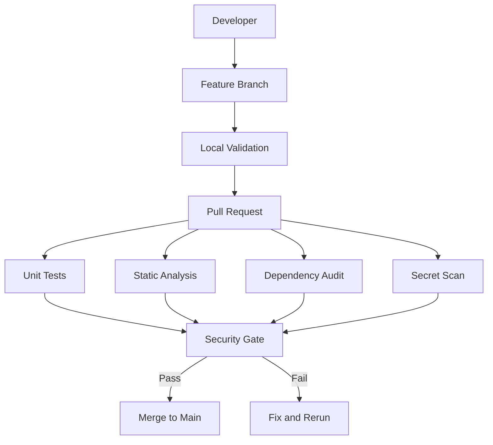
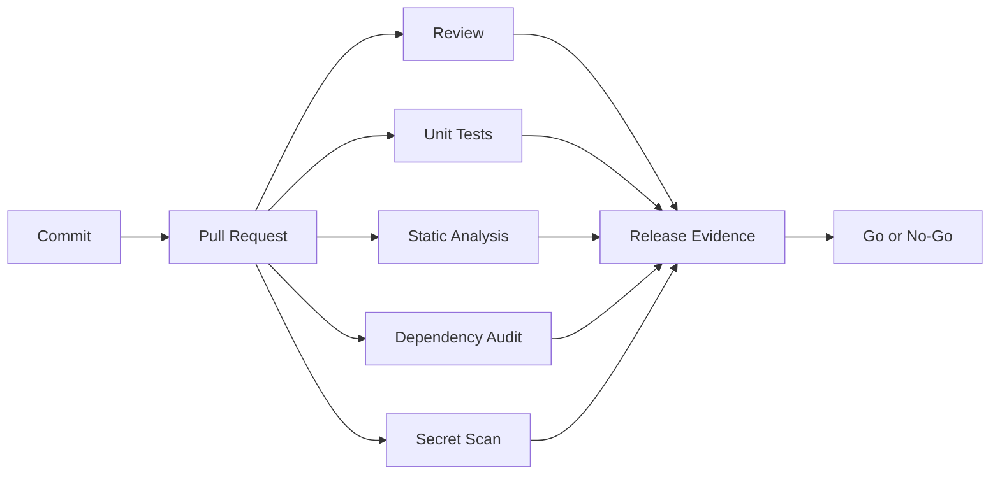

# Lab 06: DevSecOps Baseline and Secure Engineering Flow for the Mortgage Platform

**Audience:** Application engineers, QA, and DevOps contributors in the mortgage-platform training  
**Platform:** Windows 10/11, VS Code, Git, Python 3.11+, PowerShell 7+  
**Focus:** Secure Git workflow, secret prevention, SAST and SCA checks, and PR security gates  
**Estimated time:** 2.5 to 3 hours  
**Last reviewed:** 9 September 2026

## Purpose

In this lab, you will establish the first practical DevSecOps baseline for the mortgage platform. You will:

- apply a secure branch and pull-request workflow;
- prevent hardcoded secrets from entering source control;
- scan application code with static analysis;
- scan dependencies for known vulnerabilities;
- enforce local security quality gates before merge;
- simulate a security failure and validate fix-and-rerun behavior; and
- add security evidence and policy artifacts to the capstone repository.

This lab focuses on secure engineering process and controls. It is intentionally implementation-light and can be completed with a simple training API.

## Completion criteria

The lab is complete when you can show:

- feature-branch workflow with no direct push to main;
- a repository configured to ignore local secrets and environment files;
- at least one secret scan, one SAST scan, and one dependency scan execution record;
- a security gate script that fails on any required control failure;
- one simulated failure case and one successful rerun after remediation;
- a documented secure pull-request checklist; and
- capstone-ready security evidence mapping commit, scans, and approval.

## Operating model and security context

Use one training repository dedicated to this session and keep all security assets under a security folder for easy audit review.



Security baseline principle for this lab:

No change merges to main unless all mandatory checks pass.

---

## Hands-on Lab

### 00. Prepare workstation and verify prerequisites

Create a consistent local baseline before any coding or scanning steps.

Run:

```powershell
mkdir C:\training -Force
cd C:\training

mkdir mortgage-devsecops -Force
cd mortgage-devsecops

python --version
git --version
pip --version
```

If Python or Git is missing, install your organization-approved distribution and rerun version checks.

Create initial folder structure:

```powershell
mkdir app, tests, docs, security
```

Expected structure:

```text
mortgage-devsecops/
|- app/
|- tests/
|- docs/
|- security/
```

### 1. Initialize repository and baseline branch policy

Initialize Git and set the primary branch name.

```powershell
git init
git branch -M main
git status
```

Create a baseline ignore file:

File: .gitignore

```text
.venv/
__pycache__/
*.pyc
.env
.env.*
secrets/
.vscode/
.idea/
```

Why this matters:

- local environments and secret files stay out of source control;
- accidental leakage risk is reduced before first commit.

### 2. Create a minimal mortgage training API

Create and activate virtual environment:

```powershell
python -m venv .venv
.\.venv\Scripts\Activate.ps1
python -m pip install --upgrade pip
pip install fastapi uvicorn pytest httpx
```

Create File: app/main.py

```python
from fastapi import FastAPI, HTTPException

app = FastAPI(title="Mortgage Servicing API")

mortgages = {
    "LN1001": {
        "borrower_id": "BR1001",
        "borrower_name": "Amit Sharma",
        "balance": 4200000,
        "status": "CURRENT",
    },
    "LN1002": {
        "borrower_id": "BR1002",
        "borrower_name": "Neha Verma",
        "balance": 3650000,
        "status": "DELINQUENT",
    },
}


@app.get("/health")
def health():
    return {"status": "healthy"}


@app.get("/mortgages/{loan_id}")
def get_mortgage(loan_id: str):
    mortgage = mortgages.get(loan_id)
    if not mortgage:
        raise HTTPException(status_code=404, detail="Mortgage not found")
    return mortgage


@app.get("/mortgages/{loan_id}/risk")
def get_risk(loan_id: str):
    mortgage = mortgages.get(loan_id)
    if not mortgage:
        raise HTTPException(status_code=404, detail="Mortgage not found")

    risk = "HIGH" if mortgage["status"] == "DELINQUENT" else "LOW"
    return {"loan_id": loan_id, "risk": risk}
```

Run locally:

```powershell
uvicorn app.main:app --reload
```

Smoke checks:

- GET http://127.0.0.1:8000/health
- GET http://127.0.0.1:8000/mortgages/LN1001
- GET http://127.0.0.1:8000/mortgages/LN1002/risk

### 3. Create secure Git workflow with feature branch

Commit baseline:

```powershell
git add .
git commit -m "Initial mortgage API and secure repo baseline"
```

Create feature branch:

```powershell
git checkout -b feature/delinquency-status
git branch
```

Expected branch view includes main and feature/delinquency-status.

Secure workflow target:

```text
Developer -> Feature Branch -> Pull Request -> Checks -> Approval -> Main
```

### 4. Prevent and detect hardcoded secrets

Create intentionally insecure file for training demonstration.

Create File: app/database.py

```python
DATABASE_HOST = "mortgage-prod-db.internal"
DATABASE_USER = "mortgage_admin"
DATABASE_PASSWORD = "Mortgage@12345"
```

Install and run secret scan:

```powershell
# install method may vary by enterprise policy
gitleaks version
gitleaks detect --source .
```

Refactor file to environment variables:

```python
import os

DATABASE_HOST = os.getenv("DATABASE_HOST")
DATABASE_USER = os.getenv("DATABASE_USER")
DATABASE_PASSWORD = os.getenv("DATABASE_PASSWORD")
```

Create local env file for development only.

File: .env

```text
DATABASE_HOST=localhost
DATABASE_USER=mortgage_user
DATABASE_PASSWORD=local-development-only
```

Verify ignore behavior:

```powershell
git check-ignore .env
git status
```

Expected outcome:

- .env is ignored;
- no real credential remains in committed source files.

### 5. Add dependency and code security scanning

Generate dependency manifest:

```powershell
pip freeze > requirements.txt
Get-Content requirements.txt
```

Install and run dependency audit:

```powershell
pip install pip-audit
pip-audit
```

Install and run static security analysis:

```powershell
pip install bandit
bandit -r app
```

Create insecure SQL example for scanner demonstration.

Create File: app/search.py

```python
def find_borrower(connection, name):
    query = "SELECT * FROM borrower WHERE borrower_name = '" + name + "'"
    cursor = connection.cursor()
    cursor.execute(query)
    return cursor.fetchall()
```

Rerun:

```powershell
bandit -r app
```

Refactor to parameterized query:

```python
def find_borrower(connection, name):
    query = """
        SELECT *
        FROM borrower
        WHERE borrower_name = %s
    """
    cursor = connection.cursor()
    cursor.execute(query, (name,))
    return cursor.fetchall()
```

Rerun and confirm improvement:

```powershell
bandit -r app
```

### 6. Build local security quality gate

Create File: security/security-check.ps1

```powershell
Write-Host "================================="
Write-Host "Mortgage Platform Security Checks"
Write-Host "================================="

Write-Host ""
Write-Host "1) Running unit tests..."
pytest
if ($LASTEXITCODE -ne 0) {
    Write-Host "Unit tests failed"
    exit 1
}

Write-Host ""
Write-Host "2) Running static security scan..."
bandit -r app
if ($LASTEXITCODE -ne 0) {
    Write-Host "SAST failed"
    exit 1
}

Write-Host ""
Write-Host "3) Running dependency audit..."
pip-audit
if ($LASTEXITCODE -ne 0) {
    Write-Host "Dependency audit failed"
    exit 1
}

Write-Host ""
Write-Host "4) Running secret scan..."
gitleaks detect --source .
if ($LASTEXITCODE -ne 0) {
    Write-Host "Secret scan failed"
    exit 1
}

Write-Host ""
Write-Host "================================="
Write-Host "SECURITY QUALITY GATE PASSED"
Write-Host "================================="
```

Create File: tests/test_health.py

```python
from fastapi.testclient import TestClient
from app.main import app

client = TestClient(app)


def test_health():
    response = client.get("/health")
    assert response.status_code == 200
    assert response.json()["status"] == "healthy"
```

Execute full gate:

```powershell
.\security\security-check.ps1
```

### 7. Simulate failure, remediate, and rerun

Introduce a dummy secret pattern in a source file and rerun the gate.

Expected behavior:

- quality gate fails;
- merge should be blocked;
- issue must be fixed before rerun.

Remediation cycle:

```text
Fail -> Investigate -> Fix -> Commit -> Rerun -> Pass
```

Important incident rule:

If a real production credential ever reaches Git history, deletion alone is not sufficient.

Required response:

Revoke -> Rotate -> Replace -> Investigate access -> Record incident

### 8. Add PR security checklist and gate policy artifacts

Create File: security/secure-coding-checklist.md

```markdown
# Mortgage Platform Secure PR Checklist

## Secrets
- [ ] No credentials committed
- [ ] No API keys committed
- [ ] No private keys committed

## Data Protection
- [ ] Borrower PII is not unnecessarily logged
- [ ] Sensitive data is masked where appropriate
- [ ] APIs return only required fields

## Database
- [ ] Queries are parameterized
- [ ] No credentials embedded in code or connection strings

## API Security
- [ ] Input validation is applied
- [ ] Authorization requirements are identified
- [ ] Errors do not leak sensitive details

## Dependencies and Tests
- [ ] Dependency scan passes
- [ ] Unit tests pass
- [ ] Security scans pass
```

Create File: security/security-gates.md

```markdown
# Security Quality Gates

| Control | Rule |
| --- | --- |
| Unit tests | Must pass |
| Secret scan | Zero real secrets |
| SAST | No unapproved critical finding |
| SCA | No unapproved critical vulnerability |
| PR review | Required |
| Direct push to main | Prohibited |
| Sensitive logging | Prohibited |
| Security exception | Requires documented approval |
```

### 9. Capture capstone security evidence

For each release candidate, record:

- commit id;
- pull request id;
- reviewer;
- unit test result;
- SAST result;
- dependency audit result;
- secret scan result;
- gate pass or fail verdict; and
- deployment approval reference.

Use this evidence map:



---

## Mini exercise - Failure triage

Given this PR status:

- Build: PASS
- Unit tests: PASS
- SAST: FAIL
- Dependency scan: PASS
- Secret scan: FAIL

And findings:

- SQL concatenation in borrower search query;
- token-like value committed in source.

Your team must answer:

1. Why is merge blocked even if functional tests pass?
2. Which control failed for each finding?
3. What exact remediations are required?
4. What incident action is required if the token is real?
5. What evidence should be attached after rerun passes?

---

## Capstone progression for Session 6

By end of Session 5, the training capstone established business scope, environment, network design, sprint planning, and relational data model.

Session 6 adds:

- branch protection discipline;
- mandatory security validation before merge;
- secure code-review checklist;
- repeatable quality gate execution; and
- auditable release-security evidence.

This becomes the secure engineering baseline for all later labs and production-style delivery stages.
